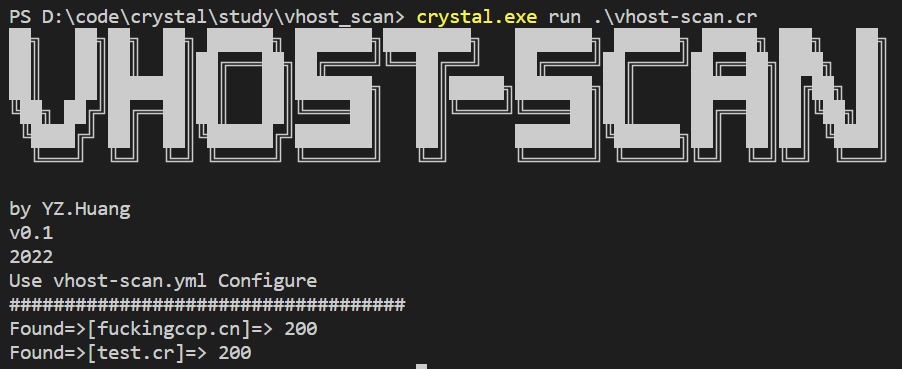

A new virtual host scanner. 
use crystal language.
keep simple.

Advantage:
1. Simple
2. Cross platform (Linux Windows OSX)
3. Scan As Code

RUN
动态编译运行

BUILD
编译后运行

v0.1
2022.05.15 21:44
需要修改扫描的配置的，直接修改源码就行
后面再考虑用配置文件
因为这个扫描还是有很多地方要灵活处理的

